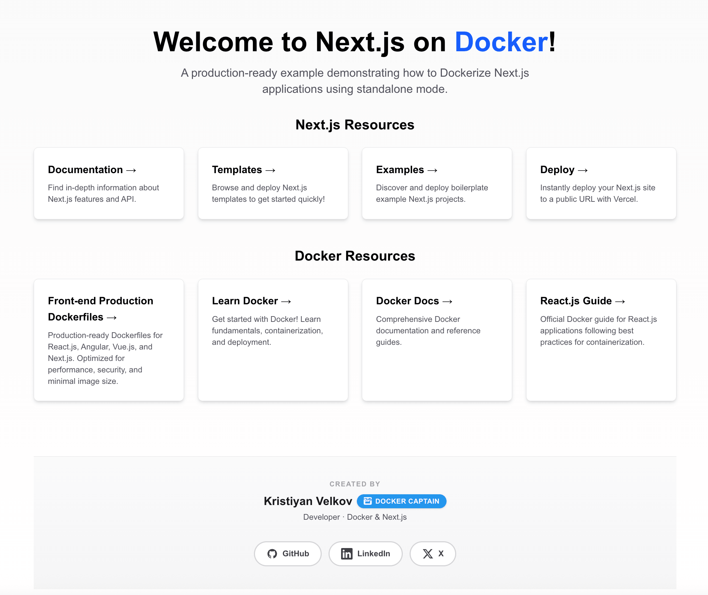

# 🐳 Docker Next.js Sample Project

[](https://opensource.org/licenses/MIT)
[](https://www.docker.com/)
[](https://nextjs.org/)
[](https://reactjs.org/)
[](https://reactjs.org/)
[](https://www.typescriptlang.org/)

A comprehensive demonstration of containerizing a modern **Next.js** application using Docker for both development and production workflows. This project showcases industry best practices for front-end containerization, including standalone and static-export builds, development with live sync, and optimized production delivery.



Part of the official **Docker Next.js** sample guide.

For full reference, including all Docker files and setup details, switch to the `development` branch.

---

## ✨ Features

- **🔥 Modern Next.js** with App Router and TypeScript
- **⚡ Standalone & static export** — Node server or static files (Nginx / serve)
- **🎨 Tailwind CSS** for utility-first styling
- **🐳 Multi-stage Docker builds** for optimized production images
- **🔧 Development & production** Docker configurations with Compose Watch
- **🧪 Testing** with Vitest and Testing Library
- **📦 Docker Compose** for easy orchestration
- **☸️ Kubernetes** deployment configuration
- **🔒 Security-focused** (non-root user, minimal base images)
- **📋 ESLint** for code quality
- **🤖 CI/CD** with GitHub Actions (see `.github/workflows`)

---

## 🛠️ Tech Stack

| Layer             | Technologies                                  |
| ----------------- | --------------------------------------------- |
| **Framework**     | Next.js 16 (App Router), React 19, TypeScript |
| **Styling**       | Tailwind CSS v4                               |
| **Testing**       | Vitest, React Testing Library                 |
| **Container**     | Docker, Docker Compose                        |
| **Orchestration** | Kubernetes (optional)                         |
| **Web Server**    | Nginx (static export), Node (standalone)      |

---

## 📋 Prerequisites

- **Docker** (v20.10+)
- **Docker Compose** (v2.0+)
- **Node.js** (v24+) — for local development
- **npm** or **yarn** or **pnpm** — for local development

---

## 🚀 Quick Start

### Using Docker (Recommended)

**Clone the repository**

```bash
git clone https://github.com/kristiyan-velkov/docker-nextjs-sample.git
cd docker-nextjs-sample
```

**Development with Docker Compose**

```bash
docker compose up nextjs-dev --build
```

Access the app at **http://localhost:3000**

**Production (standalone)**

```bash
docker compose up nextjs-prod-standalone --build
```

Access at **http://localhost:3000**

**Production (static export + Nginx)**

```bash
docker compose up nextjs-export --build
```

Access at **http://localhost:8080**

> **Note:** Only one service using port 8080 (nextjs-export, nextjs-prod-static-nginx, or nextjs-prod-static-serve) should run at a time.

### Local Development

**Install dependencies**

```bash
pnpm install
# or: npm install | yarn install
```

**Start development server**

```bash
pnpm dev
```

**Run tests**

```bash
pnpm run test:run
```

**Build for production**

```bash
pnpm build
```

---

## 🐳 Docker Commands

### Development

```bash
# Build development image
docker build -f Dockerfile.dev -t nextjs-app-dev .

# Run development container
docker run -p 3000:3000 -v $(pwd):/app nextjs-app-dev

# Using Docker Compose (recommended, with watch)
docker compose watch nextjs-dev
```

### Production (standalone)

```bash
# Build production image
docker build -t nextjs-sample:latest .

# Run production container
docker run -p 3000:3000 nextjs-sample:latest
```

### Production (static export)

```bash
# Build static export + Nginx
docker build -f Dockerfile.export -t nextjs-export .
docker run -p 8080:8080 nextjs-export
```

### One-off tasks (Compose, profile: tools)

```bash
docker compose --profile tools run --rm nextjs-test
docker compose --profile tools run --rm nextjs-lint
```

---

## ☸️ Kubernetes Deployment

Deploy the Next.js standalone app using the provided manifest:

```bash
# 1. Build the image (must match manifest)
docker build -t nextjs-sample:latest -f Dockerfile .

# 2. Apply the manifest (requires a running cluster, e.g. Docker Desktop K8s)
kubectl apply -f nextjs-sample-kubernetes.yaml
```

This creates:

- **Deployment** (`nextjs-sample`) — 1 replica
- **Service** (`nextjs-sample-service`) — NodePort **30001**

**Access:** http://localhost:30001 (Docker Desktop) or use `minikube service nextjs-sample-service --url` for minikube.

**Cleanup**

```bash
kubectl delete -f nextjs-sample-kubernetes.yaml
```

See [README.Docker.md](README.Docker.md) for detailed Kubernetes steps (Docker Desktop, minikube, kind).

---

## 📁 Project Structure

```
├── app/                        # Next.js App Router
│   ├── components/home/        # Home page components
│   ├── data/                   # Author, resources data
│   ├── layout.tsx
│   ├── page.tsx
│   └── globals.css
├── public/                     # Static assets
├── Dockerfile                   # Next.js standalone (production)
├── Dockerfile.dev               # Next.js development
├── Dockerfile.export            # Next.js static export → Nginx
├── Dockerfile.nginx             # Next.js static export → Nginx (alt)
├── Dockerfile.serve             # Next.js static export → Node serve
├── compose.yaml                 # Docker Compose configuration
├── nginx.conf                   # Nginx config for static export
├── nextjs-sample-kubernetes.yaml # Kubernetes deployment
├── Taskfile.yml                 # Task automation
└── README.Docker.md             # Docker & Kubernetes guide
```

---

## 🧪 Testing

```bash
# Local testing
pnpm run test:run

# Testing in Docker
docker compose --profile tools run --rm nextjs-test
```

---

## 🛡️ Security

This setup follows security best practices:

- **Non-root user** (node / nginx) in production images
- **Minimal base images** (slim / Alpine where applicable)
- **Lockfile-based installs** for reproducible builds
- **Multi-stage builds** to keep final image small

---

## 🔧 Configuration

### Environment Variables

| Variable      | Description         | Default                                        |
| ------------- | ------------------- | ---------------------------------------------- |
| `PORT`        | Application port    | 3000                                           |
| `NODE_ENV`    | Environment mode    | development / production                       |
| `HOSTNAME`    | Next.js server host | 0.0.0.0                                        |
| `NEXT_OUTPUT` | Next.js output mode | standalone (or `export` in export Dockerfiles) |

### Docker Compose Override

Create `compose.override.yaml` for local customizations:

```yaml
services:
  nextjs-dev:
    ports:
      - "3001:3000"
    environment:
      - CUSTOM_VAR=value
```

---

## 📚 Available Scripts

| Command             | Description              |
| ------------------- | ------------------------ |
| `pnpm dev`          | Start Next.js dev server |
| `pnpm build`        | Build for production     |
| `pnpm start`        | Start production server  |
| `pnpm lint`         | Run ESLint               |
| `pnpm run test:run` | Run tests once           |
| `pnpm test`         | Run Vitest (watch)       |

---

## 🤝 Contributing

Contributions are welcome. Please feel free to submit a Pull Request.

1. Fork the repository
2. Create your feature branch (`git checkout -b feature/AmazingFeature`)
3. Commit your changes (`git commit -m 'Add some AmazingFeature'`)
4. Push to the branch (`git push origin feature/AmazingFeature`)
5. Open a Pull Request

---

## 📝 License

This project is licensed under the **MIT License** — see the [LICENSE](LICENSE) file for details.

---

## 👨‍💻 Author

**Kristiyan Velkov**

- LinkedIn: [kristiyan-velkov](https://www.linkedin.com/in/kristiyan-velkov-763130b3/)
- Medium: [@kristiyanvelkov](https://medium.com/@kristiyanvelkov)
- Newsletter: **Front-end World**
- X: [@krisvelkov](https://x.com/krisvelkov)

---

## ☕ Support

If you find this project helpful, consider supporting:

- [GitHub Sponsors](https://github.com/sponsors/kristiyan-velkov)
- Buy Me a Coffee
- Revolut

---

## 🔗 Related Resources

- [Docker Documentation](https://docs.docker.com/)
- [Next.js Documentation](https://nextjs.org/docs)
- [Tailwind CSS](https://tailwindcss.com/docs)
- [Docker Next.js Guide](https://docs.docker.com/language/nodejs/)
